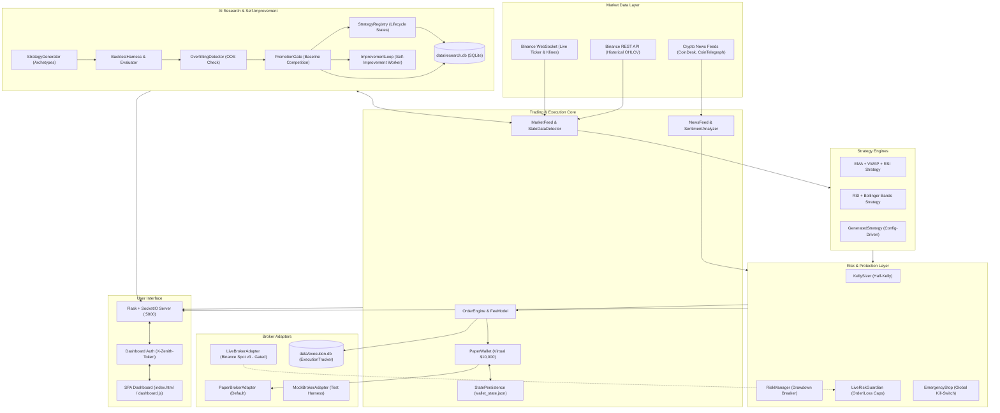

# 🤖 Zenith Trading Bot

### Real prices. Fake money. It never lies.

An institutional-grade, rule-based **AI self-improving trading bot** designed for algorithmic cryptocurrency trading. Zenith connects to real-time Binance market feeds, enforces mathematical risk management (Fractional Kelly Criterion and Drawdown Circuit Breakers), conducts empirical walk-forward backtesting with realistic fee and slippage modeling, and operates an automated research lab that discovers, validates, and refines candidate strategies.

Zenith is **paper trading by default** with virtual capital ($10,000 USDT simulation) and strict separation between research, simulated execution, and live broker integration.

---

## ⚠️ Financial & Trading Disclaimer

> [!WARNING]
> **Trading cryptocurrencies involves substantial financial risk.**
> Automated trading algorithms can fail due to market volatility, exchange outages, slippage, latency, or model breakdown. Historical backtesting and simulated paper trading performance **do not guarantee future results**. No trading algorithm can guarantee profits. Never trade with money you cannot afford to lose. Live trading integration in this bot is provided for educational and experimental purposes and has **not** been tested with real funds.

---

## 1. Current Project Status

| Component | Status | Description |
| :--- | :--- | :--- |
| **Market Data Pipeline** | ✅ **Implemented & Verified** | Live WebSocket price streams & REST OHLCV klines from Binance public endpoints. Includes stale data detection and duplicate event filtering. |
| **Strategy Engine** | ✅ **Implemented & Verified** | Baseline strategies (EMA+VWAP+RSI trend and RSI+Bollinger Bands mean reversion) plus pure NumPy/Pandas technical indicator suite. |
| **Walk-Forward Backtesting** | ✅ **Implemented & Verified** | 70/30 train/unseen test split, volatility-adjusted slippage, maker/taker fee modeling, stop-distance sizing, zero look-ahead bias. |
| **AI Strategy Research Lab** | ✅ **Implemented & Verified** | Automated blueprint generation (4 archetypes), parameter boundary constraints, indicator/operator whitelists, zero dynamic code execution (`eval`/`exec`). |
| **Self-Improvement Loop** | ✅ **Implemented & Verified** | Continuous research worker, overfitting detection (Sharpe degradation & sign flip analysis), baseline competition, promotion gating, and rollback support. |
| **Paper Trading Engine** | ✅ **Implemented & Verified** | Simulated wallet, realistic order execution, persistent state recovery across restarts, fee drag tracking, and backtest-vs-paper divergence monitoring. |
| **Live Trading Integration** | 🟡 **Gated & Unverified** | Official Binance Spot API v3 adapter implemented with HMAC-SHA256 signing, recvWindow, and key masking. **Disabled by default**; requires manual API credentials, explicit human approval phrase, and has **not** been run with real capital. |
| **Risk Management** | ✅ **Implemented & Verified** | 15% max drawdown circuit breaker with backtest revalidation requirement, 2% per-trade risk cap, Half-Kelly sizing, independent `LiveRiskGuardian`, and global `EmergencyStop`. |
| **Web Dashboard** | ✅ **Implemented & Verified** | 11 SPA views, real-time SocketIO telemetry, token authentication (`X-Zenith-Token`), state mutation confirmation modal, and zero fabricated data. |
| **Docker & AWS Deployment** | ⚪ **Planned / Not Configured** | No `Dockerfile`, `docker-compose.yml`, or AWS deployment scripts are currently configured. The bot runs natively via Python 3.12+. |

---

## 2. Key Features

### 📡 1. Market Data & Resilience
- **Real-Time WebSocket Streams**: Multi-symbol streaming (BTCUSDT, ETHUSDT) directly from Binance WebSocket streams.
- **Historical Klines**: Automatic download of historical candlestick data for in-sample training and out-of-sample testing.
- **Stale Data Detector**: Actively monitors candle freshness; raises warnings and halts order generation if data age exceeds threshold (>120s default).
- **Duplicate Event Filter**: Filters duplicate ticks and repeated signals on identical timestamps.
- **Auto-Reconnect**: Exponential backoff reconnection handler for network resilience.
- **News Sentiment Filter**: Ingests free RSS feeds from CoinDesk, CoinTelegraph, and Decrypt, blocking trades during extreme bearish sentiment.

### 🧠 2. Dual Strategy Engine
- **EMA + VWAP + RSI Trend Following (15m)**:
  - Long: EMA 9 > EMA 21, Price > session VWAP, 50 < RSI < 70.
  - Short: EMA 9 < EMA 21, Price < session VWAP, 30 < RSI < 50.
  - Exits: 2× ATR stop-loss, 2:1 risk-to-reward take-profit.
- **RSI + Bollinger Bands Mean Reversion (15m)**:
  - Enters in ranging regimes (ADX < 25) when price touches Bollinger Band extremes (20 SMA, 2.0σ) with RSI confirmation (<30 or >70) and candlestick reversal patterns (rejection wicks, engulfing).
  - Exits: Middle Bollinger Band (20 SMA), 2× ATR stop-loss, or 15-bar time stop.

### 🔬 3. AI Strategy Generator & Research Lab
- **Structured Blueprints**: Generates candidate strategies across 4 archetypes (Trend Following, Mean Reversion, Momentum/Breakout, Volatility Expansion).
- **Zero Dynamic Code Execution**: Prohibits `eval()`, `exec()`, or arbitrary Python code synthesis. Strategies are declared as JSON-serializable parameter blueprints validated against rigid indicator and operator whitelists.
- **Strategy Registry**: Lifecycle state management (`candidate` $\rightarrow$ `promoted` $\rightarrow$ `approved_for_paper` $\rightarrow$ `rejected` $\rightarrow$ `deprecated` $\rightarrow$ `legacy`) with complete audit trails.
- **Research Assistant**: Analyzes empirical experiment results and provides heuristic parameter recommendations.

### 🔄 4. Self-Improvement & Overfitting Protection
- **Walk-Forward Validation**: Evaluates strategies on unseen test data before considering promotion.
- **Overfitting Diagnostics**: Calculates out-of-sample vs. in-sample Sharpe ratio collapse, return sign flips, and test period reuse warnings.
- **Promotion Gate**: Candidates can only replace the active baseline if they achieve higher out-of-sample Sharpe ratios and meet minimum trade counts without exceeding drawdown caps.
- **One-Click Rollback**: Revert to previous baseline versions stored in the audit database.

### 💰 5. Paper Trading & Broker Abstraction
- **Paper Wallet**: Simulates $10,000 USDT starting cash, tracking floating equity, unrealized P&L, realized P&L, and 1× collateral accounting for short positions.
- **Persistent State**: Wallet positions and trade history persist to `data/logs/wallet_state.json` for safe restarts.
- **Realistic Friction**: Evaluates 0.1% spot taker fees and volatility-adjusted slippage (5 to 30 basis points) on every fill.
- **Backtest vs. Paper Comparator**: Automatically tracks real-time divergence between backtest expectations and live paper trading results.

### 🛡️ 6. Institutional Risk Management
- **Half-Kelly Position Sizing**: Uses `0.5 × (W - (1-W)/R)` to size positions from entry-to-stop distance, capping risk at 2% of equity and halting trades if edge disappears ($Kelly \le 0$).
- **Drawdown Circuit Breaker**: If equity drops 15% from its peak, all positions are liquidated and trading is suspended for 60 minutes. Trading cannot resume until out-of-sample backtest revalidation passes.
- **Independent Live Risk Guardian**: An external supervisory layer enforcing max order size ($500 default), daily loss limit ($200 default), max open positions (2), and strict 1.0× leverage ceiling.
- **Global Emergency Stop**: Instant kill-switch control that closes all open positions and cancels active orders.

### 🖥️ 7. Real-Time Web Dashboard
A dark-themed Single-Page Application (SPA) accessible at `http://localhost:5000` with **11 integrated views**:
1. **Overview**: Account equity, floating P&L, win rate, max drawdown, and equity chart.
2. **Trading History**: Realized trade table with entry/exit timestamps, fees paid, and net returns.
3. **Performance**: Cumulative return, profit factor, average win/loss, and drawdown metrics.
4. **Risk Management**: Circuit breaker state, Kelly sizing stats, and revalidation status.
5. **AI Insights**: Market regime indicators, news sentiment feeds, and headline scores.
6. **AI Research**: Active experiment runs, completed/failed counters, strategy candidates, recommendations, and rejection rationale.
7. **Strategy Comparison**: Baseline strategy benchmarked side-by-side against candidate versions with OOS Sharpe, drawdown, and lifecycle approval state.
8. **Backtesting**: Historical experiment parameters, bar intervals, equity trajectories, and backtest-vs-paper divergence metrics.
9. **Paper Trading**: Virtual wallet balance, open positions, simulated order log, fee drag, and clear **SIMULATED ACCOUNT** badges.
10. **System Monitoring**: Data feed freshness (<120s indicator), stale data alerts, broker connectivity, and system event logs.
11. **Controls**: Research job execution, candidate approval/rejection, paper trading stop, and Emergency Stop / Emergency Reset with confirmation modals.

---

## 3. System Architecture



---

## 4. Folder Structure

```
d:\projects\trading bot\
├── config/
│   └── settings.json             # Core system configuration (fees, symbols, risk, strategies)
├── data/
│   ├── execution.db              # SQLite database for execution events, fills, and orders
│   ├── research.db               # SQLite database for strategies, experiments, audit, and baseline
│   ├── history/                  # Local directory for cached historical market data
│   ├── logs/
│   │   ├── bot.log               # Main application runtime log (UTF-8)
│   │   ├── trades.csv            # Structured trade records
│   │   ├── trades.json           # JSON trade ledger
│   │   └── wallet_state.json     # Persisted paper wallet state across restarts
│   └── reports/                  # Generated AI research campaign markdown reports
├── src/
│   ├── __init__.py
│   ├── indicators.py             # Pure NumPy/Pandas technical indicator library (no TA-Lib needed)
│   ├── main.py                   # Master trading bot entry point & conductor
│   ├── strategy_config.py        # Centralized strategy parameter constants
│   ├── brain/
│   │   ├── __init__.py
│   │   ├── backtester.py         # Walk-forward backtester (70/30 train/test split)
│   │   ├── kelly_sizer.py        # Fractional Kelly Criterion position sizing engine
│   │   ├── risk_manager.py       # Drawdown circuit breaker with backtest revalidation
│   │   └── sentiment.py          # News sentiment analyzer (VADER-style rule-based lexicon)
│   ├── core/
│   │   ├── __init__.py
│   │   ├── fee_model.py          # Realistic exchange fees (VIP0 Binance) & volatility slippage
│   │   ├── market_feed.py        # Binance WebSocket streaming & REST historical data client
│   │   ├── news_feed.py          # RSS feed fetcher for CoinDesk, CoinTelegraph, Decrypt
│   │   ├── order_engine.py       # Order execution, position lifecycle, and liquidation logic
│   │   ├── paper_wallet.py       # Simulated wallet with cash, positions, equity & short collateral
│   │   └── trade_logger.py       # Structured trade writer (CSV/JSON)
│   ├── dashboard/
│   │   ├── __init__.py
│   │   ├── auth.py               # Timing-attack-safe session token management & decorators
│   │   ├── dashboard.js          # SPA controller, async data renderers, modal confirm handler
│   │   ├── index.html            # Dark-themed dashboard UI (11 views, CSS tokens, responsive layout)
│   │   └── server.py             # Flask + SocketIO dashboard backend server
│   ├── execution/
│   │   ├── __init__.py           # Execution module package exports
│   │   ├── broker_adapter.py     # PaperBrokerAdapter, LiveBrokerAdapter, MockBrokerAdapter
│   │   ├── execution_api.py      # Execution, monitoring, and emergency control REST endpoints
│   │   ├── execution_tracker.py  # SQLite event tracker for orders, fills, and risk halts
│   │   ├── live_guard.py         # External LiveRiskGuardian, LiveModeAuth, and EmergencyStop
│   │   ├── notifications.py      # In-memory and log-dispatched notification queue
│   │   ├── order_reconciler.py   # State reconciliation between broker and internal records
│   │   ├── paper_comparator.py   # Statistical divergence tracking (Paper vs. Backtest)
│   │   ├── paper_strategy_loader.py # Loader that activates approved AI strategies in paper mode
│   │   └── resilience.py         # StaleDataDetector, ReconnectHandler, DuplicateEventFilter, StatePersistence
│   ├── research/
│   │   ├── __init__.py           # Research lab package exports
│   │   ├── backtest_harness.py   # Fast backtesting harness for research experiments
│   │   ├── experiment_manager.py # Experiment deduplication, compute limits, and batch execution
│   │   ├── experiment_store.py   # SQLite storage for strategies, experiments, and results
│   │   ├── generated_strategy.py # Config-driven strategy runner (zero eval/exec, approved ops whitelist)
│   │   ├── improvement_loop.py   # Background automated self-improvement research cycle
│   │   ├── lab.py                # Research lab top-level coordinator
│   │   ├── overfitting_detector.py # Overfitting diagnostics (IS/OOS Sharpe degradation, sign flips)
│   │   ├── promotion_gate.py     # Promotion rules, baseline comparison, audit logging & rollback
│   │   ├── report_generator.py   # Research campaign markdown report generator
│   │   ├── research_api.py       # Research lab REST endpoints for dashboard integration
│   │   ├── research_assistant.py # AI assistant recommending parameter tweaks & strategy archetypes
│   │   ├── strategy_evaluator.py # Evaluates backtest results against admission thresholds
│   │   ├── strategy_generator.py # Generates candidate blueprints across 4 archetypes
│   │   └── strategy_registry.py  # Central registry for strategy versioning and metadata
│   └── strategies/
│       ├── __init__.py
│       ├── base_strategy.py      # Abstract BaseStrategy interface (enter, exit, trade plan)
│       ├── ema_vwap_rsi.py       # EMA 9/21 + VWAP + RSI trend strategy adapter
│       └── mean_reversion.py     # RSI + Bollinger Bands mean reversion strategy adapter
├── tests/
│   ├── __init__.py
│   ├── test_backtester.py        # Accounting tests for long/short backtesting
│   ├── test_dashboard_stage6.py  # Integration, security, permissions & UI tests for Stage 6
│   ├── test_improvement_loop.py  # Tests for overfitting detection, promotion gate, rollback
│   ├── test_paper_and_live.py    # Tests for adapters, risk guardian, auth, reconciliation
│   ├── test_research_lab.py      # Tests for generator, evaluator, registry, experiment store
│   └── test_wallet_and_risk.py   # Tests for wallet collateral, Kelly sizer, circuit breaker
├── .gitignore                    # Git ignore file for logs, databases, IDE, and virtual environments
├── README.md                     # This documentation file
└── requirements.txt              # Production Python package dependencies
```

---

## 5. Technology Stack

- **Core Programming Language**: Python 3.12+ (tested on Python 3.12.10)
- **Data Analysis & Mathematics**: Pandas (`>=2.2,<3.1`), NumPy (`>=1.26`)
- **Web & Async Networking**: `aiohttp` (`>=3.9`), `websockets` (`>=13.0`), Python standard `asyncio`
- **Dashboard Backend**: Flask (`>=3.0`), Flask-SocketIO (`>=5.3`), gevent (`>=24.2`), gevent-websocket (`>=0.10`)
- **Dashboard Frontend**: Vanilla HTML5, CSS3 (custom CSS design system, dark mode tokens, flexbox/grid layout), Vanilla JavaScript (ES6+ async/await, Socket.IO client, Canvas API charts)
- **Database & Storage**: SQLite3 (standard library embedded databases: `research.db` and `execution.db`), structured JSON/CSV logs
- **Testing**: `pytest` (`>=9.1`), `unittest`

---

## 6. Prerequisites

1. **Python**: Python 3.10, 3.11, or 3.12 installed on your system.
2. **Git**: Git installed for version control.
3. **Web Browser**: Any modern web browser (Chrome, Edge, Firefox, Brave, Safari) for the dashboard.
4. **Internet Connection**: Required for connecting to public Binance market feeds and RSS news. **No exchange API keys or account are needed** for market data or paper trading.

---

## 7. Installation & Setup

### Windows (PowerShell)

1. Clone or navigate to the repository:
   ```powershell
   cd "d:\projects\trading bot"
   ```

2. Create and activate a Python virtual environment:
   ```powershell
   python -m venv venv
   .\venv\Scripts\Activate.ps1
   ```

3. Install project dependencies:
   ```powershell
   python -m pip install --upgrade pip
   python -m pip install -r requirements.txt
   ```

4. Verify database and directory structure:
   The databases (`data/research.db`, `data/execution.db`) and log folders (`data/logs`, `data/history`, `data/reports`) are created automatically on the first application startup.

### Linux / macOS (Bash)

1. Navigate to the repository:
   ```bash
   cd /path/to/trading-bot
   ```

2. Create and activate virtual environment:
   ```bash
   python3 -m venv venv
   source venv/bin/activate
   ```

3. Install dependencies:
   ```bash
   pip install --upgrade pip
   pip install -r requirements.txt
   ```

---

## 8. Environment Variables

All variables are optional for standard paper trading. Only configure live credentials if you intend to prepare the live adapter.

| Variable Name | Required? | Default | Purpose |
| :--- | :---: | :---: | :--- |
| `TRADING_MODE` | Optional | `paper` | Execution mode: `paper`, `live`, or `mock`. |
| `ZENITH_DASHBOARD_TOKEN` | Optional | Auto-generated | Secret token for dashboard authentication. If omitted, the server generates a secure random token on startup. |
| `EMERGENCY_RESET_TOKEN` | Optional | Auto-generated | Token required to reset execution after an Emergency Stop. If omitted, the server generates one and logs the reset instruction. |
| `BINANCE_API_KEY` | Live Only | `None` | Binance Spot API key. Never required for paper trading. |
| `BINANCE_API_SECRET` | Live Only | `None` | Binance Spot API secret. Never required for paper trading. |

> [!CAUTION]
> **Never commit `.env` files or API secrets into Git.** Keep all API keys in environment variables or private local files excluded by `.gitignore`.

---

## 9. Running the Application

### Option A: Run the Complete Trading Bot (Recommended)
Starts the trading engine, runs initial walk-forward backtests, connects to Binance live WebSocket streams, and launches the web dashboard in the background:
```powershell
python src/main.py
```
- **Dashboard URL**: `http://localhost:5000`
- **Output**: Logs stream live prices, signal evaluations, order fills, and fee drag to the console and `data/logs/bot.log`.

### Option B: Run the Dashboard Standalone
If you only want to view research results, strategy leaderboards, backtest reports, and system monitoring without running the live trading stream:
```powershell
python -m src.dashboard.server
```
- **Dashboard URL**: `http://localhost:5000`

---

## 10. Market Data Setup

- **Default Symbols**: `BTCUSDT`, `ETHUSDT` (configurable in `config/settings.json`).
- **Default Timeframe**: `15m` (configurable to `1m`, `5m`, `15m`, `1h`, `1d`).
- **Connection Test**: On startup, `src/main.py` performs a pre-flight connection test against the Binance REST ticker endpoint:
  ```
  [STEP 2] Fetching live prices to verify connection...
  [STEP 2] ✅ Live BTCUSDT price: $...
  [STEP 2] ✅ Live ETHUSDT price: $...
  ```
- **Public Feeds**: No Binance account or API key is required to stream prices.

---

## 11. Strategy & AI Research Workflow

### 1. Generating & Registering Strategies
The `StrategyGenerator` creates candidate strategy blueprints across predefined archetypes:
```python
from src.research.strategy_generator import StrategyGenerator
from src.research.strategy_registry import StrategyRegistry
from src.research.experiment_store import ExperimentStore

store = ExperimentStore("data/research.db")
registry = StrategyRegistry(store)
generator = StrategyGenerator(registry=registry)

# Generate a trend-following candidate
blueprint = generator.generate_trend_following()
strat_id = registry.register_generated(blueprint, archetype="trend_following")
```

### 2. Running an Experiment
```python
from src.research.backtest_harness import BacktestHarness
from src.research.strategy_evaluator import StrategyEvaluator

harness = BacktestHarness(config)
evaluator = StrategyEvaluator()

# Evaluates the candidate on training and out-of-sample data
metrics = harness.evaluate_blueprint(blueprint, "BTCUSDT", interval="15m", days=90)
evaluation = evaluator.evaluate(metrics)
```

### 3. Baseline Promotion & Gating
Candidates must beat the active baseline on unseen data before they can be promoted:
```python
from src.research.promotion_gate import PromotionGate

gate = PromotionGate(store, registry)
promoted = gate.evaluate_and_promote(strat_id, candidate_metrics, baseline_metrics)
# If successful, candidate becomes the new baseline and an audit entry is created.
```

### 4. Rollback
If a promoted strategy underperforms in paper trading, rollback to the previous baseline:
```python
previous_id = gate.rollback()
```

---

## 12. Walk-Forward Backtesting

The backtesting engine (`src/brain/backtester.py`) applies institutional standards to prevent overfitting:
- **70% Training / 30% Unseen Test**: Strategies must prove positive edge on unseen market data.
- **Realistic Exchange Costs**: Deducts Binance spot maker/taker fees and volatility-scaled slippage from every trade.
- **Deterministic Fills**: Order fills are simulated deterministically without future look-ahead bias. Random fill jitter is disabled during backtests for reproducibility.
- **Minimum Criteria**: Rejects strategies with Sharpe ratio $< 0.5$ or fewer than 20 trades.

---

## 13. Paper Trading

- **Virtual Funds**: Initial balance defaults to $10,000 USDT.
- **Spot Mode Default**: Trades long-only signals. Short signals are ignored unless futures fee mode and `trading.allow_short: true` are configured.
- **Real-Time Portfolio Accounting**: Computes floating equity, realized P&L, cumulative broker fees, and maximum drawdown against real price ticks.
- **Restart Recovery**: Automatically saves wallet state to `data/logs/wallet_state.json` and restores open positions upon reboot.

---

## 14. Live Trading (Gated & Safety Constrained)

Zenith includes an official Binance Spot API v3 adapter (`LiveBrokerAdapter`), but enforces strict safety gates:
1. **Disabled by Default**: The application starts in `paper` mode unless explicitly configured otherwise.
2. **Environment Variable Credentials**: API keys must be loaded from `BINANCE_API_KEY` and `BINANCE_API_SECRET`. Keys are never stored in config files.
3. **Cryptographic Signing**: Requests are signed using HMAC-SHA256 with millisecond timestamps and a 5000ms `recvWindow`.
4. **Mandatory Human Approval**: Switching to live mode via `LiveModeAuth` requires entering the exact confirmation phrase:
   ```
   "I VERIFY ACCOUNT AND RISK LIMITS FOR LIVE TRADING"
   ```
5. **Frozen Risk Guardian**: The `LiveRiskGuardian` operates outside the AI module with frozen risk caps ($500 max order, $200 daily loss limit, 2 open positions max, 1.0× leverage ceiling).
6. **Live Execution Verification Status**: **Unverified with real money**. Do not enable live trading without reviewing all risk limits and account settings.

---

## 15. Dashboard Guide & Endpoints

Open `http://localhost:5000` to access the interface:

```
┌──────────────────┬────────────────────────────────────────────────────────┐
│  ZENITH BOT      │  Overview | Trading History | Performance | Risk       │
│  [SIMULATED]     │  AI Insights | AI Research | Strategy Comparison       │
├──────────────────┤  Backtesting | Paper Trading | Monitoring | Controls   │
│  Navigation Menu │────────────────────────────────────────────────────────│
│  - 11 SPA Views  │  Interactive Real-Time Data Tables, Metrics Cards,     │
│  - Token Auth    │  Canvas Equity Charts, and Confirmation Modal Controls │
└──────────────────┴────────────────────────────────────────────────────────┘
```

### Security & State Mutation Confirmation
- **Session Token**: On page load, the frontend retrieves a timing-attack-safe session token via `GET /api/auth/token` and attaches it to request headers (`X-Zenith-Token`).
- **Confirmation Modal**: Any mutating control action (starting/stopping research jobs, approving/rejecting strategies, triggering emergency stops) displays an interactive modal dialog requiring explicit user confirmation. Requests without `{"confirmation": true}` are rejected with HTTP 400.
- **Zero API Secret Exposure**: API secret keys and private keys are never returned by any endpoint or rendered in the UI.

---

## 16. Risk Management & Safety Limits

- **Drawdown Circuit Breaker**: Trips when floating drawdown hits 15%. Immediately liquidates open positions, logs the event, and enforces a 60-minute cooldown.
- **Mandatory Revalidation**: After the circuit breaker cooldown expires, trading remains suspended until an automated out-of-sample backtest confirms that at least one strategy has a verified statistical edge.
- **Half-Kelly Position Sizing**: Recalculates every 20 trades. If empirical win rate and reward-to-risk ratio result in $Kelly \le 0$, position sizing drops to zero.
- **Global Emergency Stop**: Accessible via the **Controls** dashboard view or `POST /api/execution/emergency-stop`. Instantly halts the trading loop, cancels active orders, and liquidates open positions.

---

## 17. Database Schema & Recovery

The bot maintains two local SQLite databases in `data/`:

### `data/research.db`
- `strategies`: Strategy metadata, archetypes, parameters, creation timestamps, and lifecycle status.
- `experiments`: Experiment batch runs, timeframe, symbol, data split, and commit hash.
- `experiment_results`: In-sample and out-of-sample Sharpe, win rate, drawdown, total return, and trade count.
- `research_reports`: Diagnostic markdown reports generated by research campaigns.
- `promotion_audit`: Immutable audit log of all strategy promotions, rejections, and rollbacks.
- `active_baseline`: Currently active benchmark strategy against which candidates compete.

### `data/execution.db`
- `execution_events`: Comprehensive audit log of signals, orders, fills, rejections, and risk guardian interventions.

### Backup & Recovery
To back up system state and research history:
```powershell
Copy-Item data\research.db data\research.db.bak
Copy-Item data\execution.db data\execution.db.bak
Copy-Item data\logs\wallet_state.json data\logs\wallet_state.json.bak
```

---

## 18. Testing & Verification

Zenith includes a comprehensive test suite of **104 automated tests** covering accounting, research, execution, risk controls, and dashboard integration.

### Run All Tests
```powershell
pytest -v
```

### Test Suite Breakdown
| Test File | Test Count | Scope |
| :--- | :---: | :--- |
| `tests/test_dashboard_stage6.py` | 11 | Dashboard routes, token auth, confirmation modal, secret masking, real data integrity. |
| `tests/test_improvement_loop.py` | 21 | Overfitting detection, baseline competition, promotion gating, audit logs, rollback. |
| `tests/test_paper_and_live.py` | 31 | Mock broker, paper adapter, live HMAC signatures, key masking, risk guardian, emergency stop. |
| `tests/test_research_lab.py` | 26 | Strategy generator, blueprint validation, evaluator, experiment store, budget limits. |
| `tests/test_wallet_and_risk.py` | 5 | Short collateral, Kelly sizer bootstrap, circuit breaker cooldown and revalidation. |
| `tests/test_backtester.py` | 3 | Long/short accounting, spot short rejection, ending balance calculations. |
| **Total** | **104** | **All 104 tests pass in ~5.4 seconds.** |

---

## 19. Deployment

- **Current Environment**: Native Python 3.12+ execution on Windows, Linux, or macOS.
- **Containerization (Docker)**: Not currently configured. (No `Dockerfile` or `docker-compose.yml` present).
- **Cloud Deployment (AWS/GCP)**: Not currently configured. To deploy on a cloud virtual machine (e.g. AWS EC2, Ubuntu 22.04 LTS):
  1. Launch an EC2 instance with Python 3.12.
  2. Clone the repository and configure virtual environment.
  3. Install dependencies from `requirements.txt`.
  4. Run via `systemd` or `supervisord` service.
  5. Ensure port 5000 is protected behind a reverse proxy (e.g., NGINX) with HTTPS/TLS.

---

## 20. Troubleshooting

| Symptom | Cause | Solution |
| :--- | :--- | :--- |
| `Could not fetch live price` on startup | No internet connection or Binance public API blocked | Check your network connection. Verify that `https://api.binance.com` is reachable in your browser. |
| Dashboard shows `Disconnected` | Dashboard server not running or WebSocket blocked | Verify that `python src/main.py` is running and port 5000 is open. |
| `401 Unauthorized` on Control action | Missing or invalid session token | Refresh the browser page to acquire a fresh session token from `/api/auth/token`. |
| `400 Bad Request: Confirmation required` | Action submitted without confirmation flag | Use the dashboard UI buttons, which trigger the confirmation modal automatically. |
| Emergency Stop active; cannot trade | Circuit breaker or emergency halt triggered | Use the **Emergency Reset** button in the Controls panel and supply the `EMERGENCY_RESET_TOKEN`. |
| `NO strategies passed the backtest` | Recent market conditions did not show edge on test data | Normal behavior. Zenith refuses to trade unless a strategy demonstrates statistical edge on unseen data. |

---

## 21. Security Best Practices

1. **Protect Exchange Credentials**: If testing the live adapter, never store keys in configuration files. Use environment variables.
2. **Use API Restrictions**: When creating exchange API keys, enable **Read** and **Spot Trading** only. **Never enable Withdrawals**.
3. **Restrict Dashboard Access**: Do not expose port 5000 directly to the public internet without an authenticating reverse proxy (NGINX with HTTP Basic Auth or TLS client certificates).
4. **Audit Dependencies**: Regularly audit third-party Python packages using `pip audit`.

---

## 22. Known Issues & Limitations

- **Live Trading Unverified**: The live broker integration is fully implemented with security controls, but has not been tested with live capital.
- **Single Exchange Focus**: Market data and live adapter currently support Binance Spot endpoints only.
- **Docker / AWS Scripts**: Container images and automated cloud deployment infrastructure are not yet included in the workspace.
- **Shorting Limitations**: Short signals are disabled by default in spot mode; shorts require simulated futures mode.

---

## 23. Development & Contribution Workflow

1. **Check Status**: Ensure you are on the `dev` branch:
   ```powershell
   git status
   ```
2. **Create Feature Branch**:
   ```powershell
   git checkout -b feature/your-feature-name
   ```
3. **Run Test Suite**: Always ensure all 104 tests pass before committing:
   ```powershell
   pytest
   ```
4. **Commit Changes**: Use descriptive commit messages following Conventional Commits (e.g. `feat:`, `fix:`, `docs:`).

---

## 24. License

This project is licensed for educational, research, and private algorithmic development purposes.
See project source files for individual component documentation.
