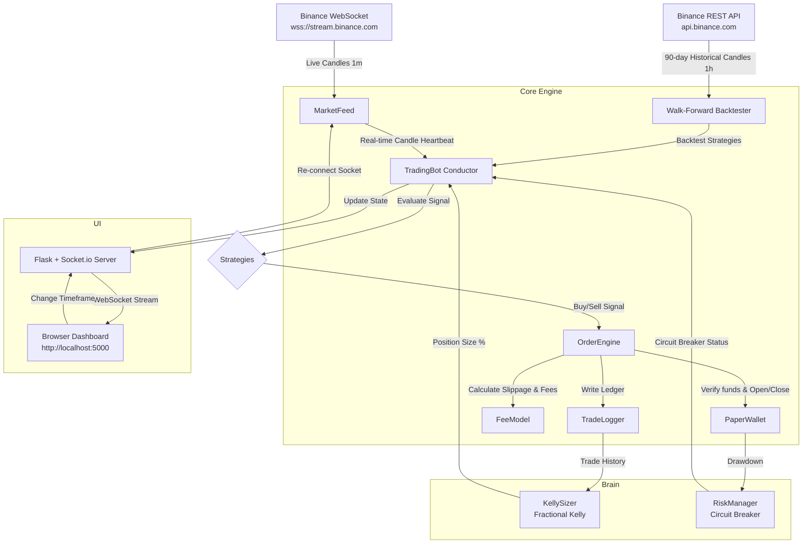

# 🤖 Zenith Trading Bot — Codebase Analysis

This document provides a comprehensive analysis of the **Zenith Trading Bot**, an automated paper trading system designed to trade cryptocurrency using live prices from Binance and simulated funds. 

The bot is designed around the core principle of **absolute honesty**: it never fakes a fill, a price, or a profit. It simulates realistic transaction fees, variable slippage, and funding costs, and automatically shuts down if safety limits are exceeded.

---

## 📐 System Architecture

The following diagram illustrates how data flows through the application in real-time:

---

## 📋 File-by-File Breakdown

### 1. The Conductor: `src/main.py`
* **Purpose:** The central coordinator. It initializes all components, loads configuration, manages the websocket connection, runs backtests, and triggers trade actions.
* **Flow:**
  1. Spawns the Flask-SocketIO dashboard server in a background thread.
  2. Pulls 90 days of historical data and runs walk-forward backtesting on all strategies.
  3. Filters strategies, enabling only those that pass criteria (Sharpe ratio $\ge 0.5$, $\ge 20$ trades).
  4. Starts streaming live candles via WebSocket. On every closed candle, it runs risk checks, evaluates strategy signals, sizes trades using the Kelly Criterion, executes orders, and pushes updates to the dashboard.

### 2. Market Data: `src/core/market_feed.py`
* **Endpoints Used:**
  * WebSocket: `wss://stream.binance.com:9443/ws` (live 1m klines).
  * REST API: `https://api.binance.com/api/v3/klines` (historical klines).
* **Highlights:** 
  * Connects to public endpoints; **zero API keys required**.
  * Aggregates candles on the fly.
  * Implements auto-reconnect logic with exponential backoff if the WebSocket drops.

### 3. Cost Engine: `src/core/fee_model.py`
* **Fees:** Standard Binance spot VIP 0 taker rate (0.1% / `0.001` decimal) is hardcoded by default.
* **Slippage:** Slippage simulates market impact. The formula used is:
  $$\text{Slippage (BPS)} = \min(\text{Base BPS} + \text{Volatility} \times \text{Multiplier} \times 100 + \text{Size Component}, \text{Max BPS})$$
  * Default base slippage is 5 bps (0.05%).
  * Under volatile conditions (calculated as standard deviation of recent candle returns), slippage scales up to a maximum cap of 30 bps (0.30%).
  * A random $\pm 20\%$ jitter is applied to prevent perfect predictability.

### 4. Trade Execution: `src/core/order_engine.py` & `src/core/paper_wallet.py`
* **Order Type:** Uses market orders only. Fills are executed at the live price adjusted by slippage.
* **Double-Counting Avoided:** The `PaperWallet.total_equity` function computes portfolio value by adding the cash balance to the valuation of open positions. Short positions are valued using the formula:
  $$\text{Value}_{\text{short}} = Q \times (2 \times P_{\text{entry}} - P_{\text{current}})$$
  This ensures that if the price increases, the equity decreases, and vice versa, accurately modeling short liability while holding 100% margin.

### 5. Position Sizing: `src/brain/kelly_sizer.py`
* **Mathematics:** Implements the classic Kelly Criterion:
  $$f^* = W - \frac{1 - W}{R}$$
  Where $W$ is the win rate and $R$ is the risk-reward ratio (average win divided by average loss).
* **Safety Buffer:** Uses **Half-Kelly** ($0.5 \times f^*$) to reduce volatility and drawdown while retaining $\sim 75\%$ of the growth rate. Capped at a maximum risk of 2% of equity per trade. If Kelly $\le 0$, it returns 0 (stops trading that strategy).

### 6. Safety Net: `src/brain/risk_manager.py`
* **Drawdown Breaker:** Monitors drawdown from the peak equity value. If drawdown reaches the limit (15% in configuration), it triggers the circuit breaker:
  1. Shuts down all open positions immediately via market orders.
  2. Stops the bot from taking any new trades.
  3. Activates a 60-minute cooldown period.
  4. Requires strategies to pass the backtester again before resuming.

### 7. Web Dashboard: `src/dashboard/`
* **Server (`server.py`):** Starts a lightweight Flask web server and uses SocketIO to push live updates every 3 seconds to the browser client.
* **Layout (`index.html`):** Modern warm-dark dark theme utilizing glassmorphism and sidebar navigation.
* **Controller (`dashboard.js`):** Multi-view SPA (Single Page Application) that manages transitions between **8 views**:
  1. **Overview:** Equity curves (drawn dynamically using HTML5 Canvas), win rate, drawdown, and progress bar toward a $500 target.
  2. **Positions:** Real-time unrealized PnL table.
  3. **Episodes:** Visualizes trading cycles (episodes) in bars (green = hit target, red = blown up/breaker).
  4. **Evolution:** Generation trackers, overall performance metrics.
  5. **Strategies:** Displays backtest scorecard for SMAs, RSI, and Breakouts.
  6. **World:** Live market feed tiles.
  7. **Lessons:** AI-driven text takeaways (biggest win, biggest loss, fee impact, honesty reminders).
  8. **Trades:** History log.

---

## ⚡ Key Strengths

1. **Strict Walk-Forward Backtester:** Backtests split data (70% train, 30% test) to prevent curve fitting. Many retail bots fail because they optimize parameters on the entire dataset; this bot tests on unseen data.
2. **Realistic Friction Model:** By forcing market fills with variable slippage and standard VIP-0 fees, the paper trading results are highly realistic. 
3. **No API Key Dependency:** The bot connects to public websocket endpoints, allowing users to safely learn and observe without linking personal accounts.
4. **Fractional Kelly Sizing:** Automates bet sizing mathematically, reducing size when the win rate or R:R drops, and halting trading if there is no mathematical edge.

---

## ⚠️ Risks and Limitations

1. **Spot Mode Only for Shorts:** Although `PaperWallet` supports short pricing logic, Binance spot markets do not support short selling without margin borrowing. Thus, the strategies only execute `long` orders in live trading.
2. **Textbook Strategies:** Simple SMA Crossovers, RSI mean reversion, and Donchian channels have low edges in highly efficient modern crypto markets. Under walk-forward testing, they will fail frequently (which is displayed honestly).
3. **Local Threading Server:** Flask's SocketIO uses standard threading, which is acceptable for local paper trading but could experience latency under heavy multi-client access.
