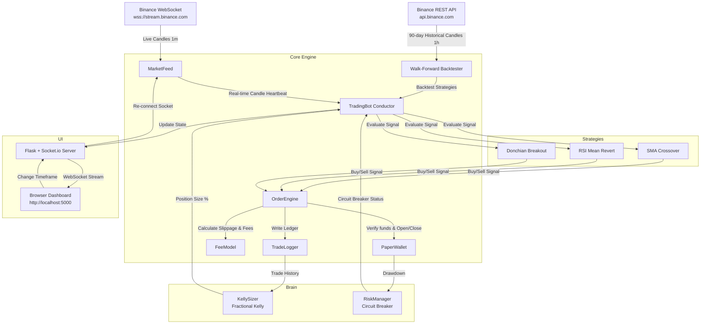
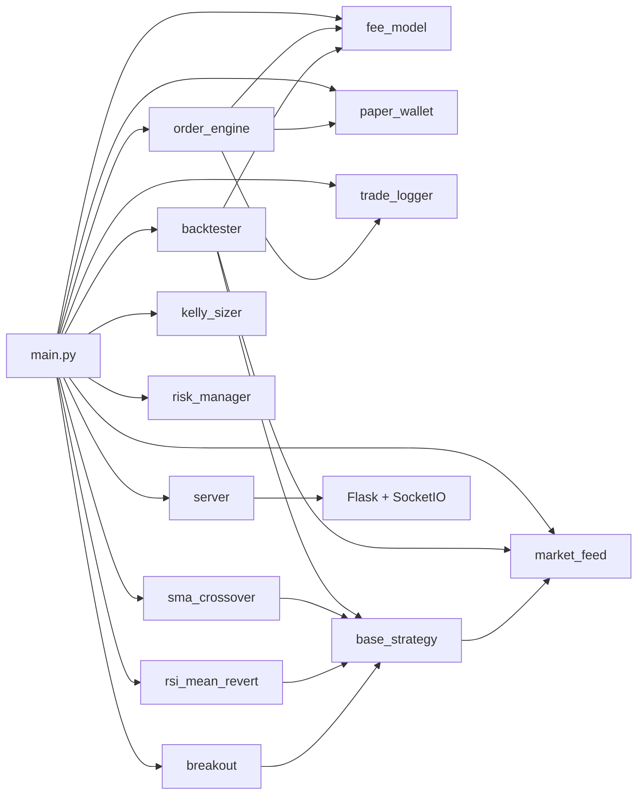

# 🤖 Zenith Trading Bot — Complete Codebase Analysis

This document provides a comprehensive analysis of the **Zenith Trading Bot**, an automated paper trading system that trades cryptocurrency using live prices from Binance and simulated funds.

The bot is designed around the core principle of **absolute honesty**: it never fakes a fill, a price, or a profit. It simulates realistic transaction fees, variable slippage, and funding costs, and automatically shuts down if safety limits are exceeded.

| Property | Value |
|---|---|
| **Language** | Python 3.10+ |
| **Lines of Code** | ~3,300 (Python) + ~2,500 (HTML/CSS/JS) |
| **Entry Point** | `python src/main.py` |
| **Dashboard** | `http://localhost:5000` |
| **API Keys** | None required (public Binance endpoints) |
| **Dependencies** | websockets, aiohttp, flask, flask-socketio, gevent, numpy, pandas |

---

## 📐 System Architecture

The following diagram illustrates how data flows through the application in real-time:



---

## 📁 Project Structure

```
config/
  settings.json              — All tunable parameters (balance, fees, risk, strategies)

src/
  main.py                    — Entry point, trading loop orchestrator (456 lines)
  
  core/
    market_feed.py           — Binance WebSocket + REST API (222 lines)
    paper_wallet.py          — Fake money wallet, positions, equity (319 lines)
    fee_model.py             — Trading fees + slippage simulation (149 lines)
    order_engine.py          — Market buy/sell with cost pipeline (147 lines)
    trade_logger.py          — Persistent trade logging to CSV + JSON (102 lines)
  
  strategies/
    base_strategy.py         — Abstract base class for all strategies (98 lines)
    sma_crossover.py         — SMA Crossover strategy (91 lines)
    rsi_mean_revert.py       — RSI Mean Reversion strategy (101 lines)
    breakout.py              — Donchian Channel Breakout strategy (71 lines)
  
  brain/
    backtester.py            — Walk-forward backtester (390 lines)
    kelly_sizer.py           — Fractional Kelly Criterion sizing (137 lines)
    risk_manager.py          — Drawdown circuit breaker + cooldown (141 lines)
  
  dashboard/
    server.py                — Flask + SocketIO server with REST API (211 lines)
    index.html               — Dashboard UI (1,235 lines — sidebar SPA, 8 views)
    dashboard.js             — Real-time rendering engine (1,000+ lines)

data/
  logs/                      — Trade logs (trades.csv, trades.json, bot.log)
  history/                   — Cached historical candle data
```

---

## 📋 File-by-File Breakdown

### 1. The Conductor: [main.py](src/main.py)

The central coordinator that ties every component together.

**Key Class:** `TradingBot` — initializes all components, manages the WebSocket connection, runs backtests, and triggers trade actions.

**Startup Sequence:**
1. Load config from `settings.json`
2. Initialize all components (wallet, fee model, strategies, backtester, etc.)
3. Spawn the Flask-SocketIO dashboard in a background thread
4. Fetch a live price to verify Binance connectivity
5. Run walk-forward backtests on all strategies
6. Filter — only activate strategies that pass on unseen test data
7. Start WebSocket streaming and enter the live trading loop

**Live Trading Loop (`_on_candle`):**
- Triggered on every WebSocket candle event
- Only acts on **closed** candles (complete OHLCV data)
- Order of operations: risk check → drawdown check → evaluate strategy exit signals → evaluate entry signals → size via Kelly → execute through OrderEngine
- Exits are checked **before** entries (prevents same-candle flip)
- Pushes dashboard state updates every 3 seconds via `asyncio.create_task`

**Notable Design Decisions:**
- If **no strategy passes** backtest, all are activated anyway in "observation mode" with minimum position sizes — debatable but practical for demo/learning purposes
- Supports dynamic **timeframe switching** from the dashboard — restarts the WebSocket stream
- Graceful shutdown on `Ctrl+C` with a final honest performance report

---

### 2. Market Data: [market_feed.py](src/core/market_feed.py)

**Class:** `MarketFeed` — pulls real live prices from Binance public API.

| Mode | Purpose | Endpoint |
|------|---------|----------|
| **WebSocket** | Real-time kline stream (live trading) | `wss://stream.binance.com:9443/ws/{symbol}@kline_{interval}` |
| **REST** | Historical candles (backtesting) | `GET /api/v3/klines` |

**Key Characteristics:**
- Connects to public endpoints; **zero API keys required**
- Uses `websockets` library with `ping_interval=20`, `ping_timeout=10`
- Auto-reconnects if the WebSocket drops (5s delay for clean close, 10s for error)
- Paginated historical fetch via `get_all_historical_klines()` — batches of 1000 with 100ms rate-limit delay

**Data Model:** `Candle` uses `__slots__` for memory efficiency:
- Fields: `timestamp`, `open`, `high`, `low`, `close`, `volume`, `is_closed`
- All prices come straight from Binance — never generated, interpolated, or cached stale

---

### 3. Cost Engine: [fee_model.py](src/core/fee_model.py)

**Class:** `FeeModel` — calculates real trading costs for every order.

Three cost components applied to every single trade:

**Trading Fees:**
- Standard Binance spot VIP 0 taker rate (0.1% / `0.001` decimal) is the default
- Supports both spot and futures fee tiers
- Formula: `fee = notional_value × rate`

**Slippage Simulation:**
Slippage simulates market impact — the price moves against you when you hit the market:

$$\text{Slippage (BPS)} = \min(\text{Base BPS} + \text{Volatility} \times \text{Multiplier} \times 100 + \text{Size Component}, \text{Max BPS})$$

- Default base slippage is **5 bps** (0.05%)
- Under volatile conditions (calculated from standard deviation of recent candle returns), slippage scales up to a maximum cap of **30 bps** (0.30%)
- A random **±20% jitter** is applied to prevent perfect predictability
- Buying → price goes **UP**; Selling → price goes **DOWN** (always worse for you)

**Funding Fees:**
- Available for futures mode (disabled by default since we trade spot)

---

### 4. Paper Wallet: [paper_wallet.py](src/core/paper_wallet.py)

**Classes:** `Position`, `PaperWallet`

The "bank" of the paper trading bot — holds fake USDT, tracks positions, and calculates equity truthfully.

**Position Tracking:**
- Each position records: symbol, side (long/short), quantity, entry price (after slippage), fees paid, timestamp
- Unrealized PnL calculated against real current price

**Cash Flow:**
- `open_position()` deducts `(exec_price × qty + fee)` from cash
- `close_position()` adds `(exec_price × qty - fee)` back to cash
- Balance can go to zero — the bot doesn't prevent it, it shows it

**Equity Calculation:**
The `total_equity()` function computes portfolio value by adding the cash balance to the valuation of open positions. Short positions are valued using:

$$\text{Value}_{\text{short}} = Q \times (2 \times P_{\text{entry}} - P_{\text{current}})$$

This ensures that if the price increases, the equity decreases, and vice versa, accurately modeling short liability while holding 100% margin.

**Drawdown:**
- Tracks peak equity across the session
- `get_drawdown()` returns percentage drop from peak: $(peak - current) / peak \times 100$

---

### 5. Order Execution: [order_engine.py](src/core/order_engine.py)

**Class:** `OrderEngine` — the "cashier" that processes every order through the full cost pipeline.

**Order Pipeline:**
1. Calculate slippage → get execution price (always worse than market)
2. Calculate fee on the slipped notional value
3. Update wallet (open or close position)
4. Log the trade to disk

**Order Types:**
- `market_buy()` → opens a long position
- `market_sell()` → closes an existing position by ID
- `close_all()` → emergency close all positions (used by circuit breaker)

**Honesty Rules:**
- Market orders only — never assumes perfect limit fills
- Execution price = live price + slippage
- A losing trade closes at whatever the market says — no delay, no rounding

---

### 6. Trade Logging: [trade_logger.py](src/core/trade_logger.py)

**Class:** `TradeLogger` — records every trade to disk for full transparency.

**Dual-Format Persistence:**
- **CSV** (`data/logs/trades.csv`) — easy to open in Excel or Google Sheets
- **JSON** (`data/logs/trades.json`) — easy to read programmatically

**Fields Logged:**
`id`, `symbol`, `side`, `quantity`, `entry_price`, `exit_price`, `entry_time`, `exit_time`, `gross_pnl`, `total_fees`, `net_pnl`, `net_pnl_pct`, `balance_after`, `duration_seconds`

> **Note:** The JSON logger reads the entire file, appends, and rewrites on every trade. This works fine for paper trading volumes but would be a bottleneck at scale.

---

### 7. Strategy Base: [base_strategy.py](src/strategies/base_strategy.py)

**Class:** `BaseStrategy` (ABC) — the interface every trading strategy must implement.

Every strategy answers two questions:
1. **`should_enter()`** → `'long'` / `'short'` / `None` — should I open a new trade?
2. **`should_exit(position_side)`** → `True` / `False` — should I close my current trade?

**Built-in Helpers:**
- `update(candle)` — feed new candle data (only stores closed candles)
- `closes`, `highs`, `lows`, `volumes` — convenient price list properties
- `has_enough_data(min_candles)` — guard against insufficient history
- `reset()` — clear history for new backtest runs

**To add a new strategy:** Subclass `BaseStrategy`, implement `should_enter()` and `should_exit()`, add config in `settings.json` and instantiation in `main.py`.

---

### 8. SMA Crossover Strategy: [sma_crossover.py](src/strategies/sma_crossover.py)

**Class:** `SMACrossover`

Tracks two moving averages of the price — one short (recent) and one long (older).

| Parameter | Default | Description |
|---|---|---|
| `short_period` | 10 | Fast moving average window |
| `long_period` | 30 | Slow moving average window |

- **Entry (long):** Short SMA crosses **above** Long SMA (golden cross)
- **Exit:** Short SMA crosses **below** Long SMA (death cross)
- Requires `long_period + 1` candles (31) before generating the first signal
- Detects crossovers by comparing current vs. previous candle SMA values

*Honest disclaimer: works in trending markets, gets chopped up in sideways markets. No proven long-term edge.*

---

### 9. RSI Mean Reversion Strategy: [rsi_mean_revert.py](src/strategies/rsi_mean_revert.py)

**Class:** `RSIMeanRevert`

RSI (Relative Strength Index) measures how "overbought" or "oversold" an asset is on a 0–100 scale.

| Parameter | Default | Description |
|---|---|---|
| `period` | 14 | RSI lookback period |
| `oversold` | 30 | Buy threshold |
| `overbought` | 70 | Sell threshold |

- **Entry (long):** RSI drops below 30 (oversold — might bounce)
- **Exit:** RSI rises above 70 (overbought — might pull back)

**RSI Calculation (Wilder Smoothing):**

$$RSI = 100 - \frac{100}{1 + RS}$$

Where $RS = \frac{\text{Average Gain}}{\text{Average Loss}}$ computed using Wilder's exponential smoothing over the lookback period.

*Honest disclaimer: works when markets bounce, but in a real crash "oversold" can get more oversold.*

---

### 10. Donchian Breakout Strategy: [breakout.py](src/strategies/breakout.py)

**Class:** `BreakoutStrategy`

Looks at the highest high and lowest low of the last N candles (the "channel"). When price breaks above the channel, it signals new momentum.

| Parameter | Default | Description |
|---|---|---|
| `period` | 20 | Donchian channel lookback |

- **Entry (long):** Close price > highest high of previous N candles (channel breakout)
- **Exit:** Close price < lowest low of previous N candles (channel breakdown)

*Honest disclaimer: many false signals in choppy markets — relies on a few big winners to cover many small losses.*

---

### 11. Walk-Forward Backtester: [backtester.py](src/brain/backtester.py)

**Classes:** `BacktestResult`, `Backtester`

Tests strategies against real past prices from Binance and applies full fees + slippage. It does NOT cherry-pick results.

**Walk-Forward Method:**
1. Download **90 days** of real hourly candles from Binance
2. Split: first **70% for training**, last **30% for testing**
3. Run strategy on training data (sanity check — does it work at all?)
4. Run strategy on **unseen test data** (the honest score)
5. Only keep strategies that pass on the test set

**Pass Criteria:**
- ≥ 20 trades (statistically meaningful)
- Sharpe ratio ≥ 0.5 (reasonable risk-adjusted return)
- Total return > 0% (actually profitable)

**Metrics Computed:**

| Metric | Description |
|--------|-------------|
| Win Rate | Winning trades / total trades |
| Total Return % | (ending − starting) / starting × 100 |
| Max Drawdown % | Largest peak-to-trough decline |
| Sharpe Ratio | $\frac{\text{mean}(R)}{\text{std}(R)} \times \sqrt{N}$ (annualized) |
| Profit Factor | Gross profit / gross loss |
| Avg Win / Avg Loss | Mean size of winning vs losing trades |

**Backtest Position Sizing:** Fixed 10% of balance per trade (simpler than live Kelly sizing)

> **Note:** Backtest uses a fixed 10% size while live trading uses Kelly criterion — this inconsistency means backtest results may not precisely predict live performance.

---

### 12. Kelly Criterion Sizer: [kelly_sizer.py](src/brain/kelly_sizer.py)

**Class:** `KellySizer`

Uses math to decide **how much to bet on each trade** based on historical win rate and reward-to-risk ratio.

**The Formula (verified from Wikipedia + multiple trading sources):**

$$f^* = W - \frac{1 - W}{R}$$

Where:
- $W$ = win rate (e.g., 0.55 = 55% of trades win)
- $R$ = risk-reward ratio ($\frac{\text{avg win}}{\text{avg loss}}$)
- $f^*$ = fraction of capital to risk

**Safety Mechanisms:**

| Mechanism | Detail |
|-----------|--------|
| **Half-Kelly** | Uses $0.5 \times f^*$ — keeps ~75% of growth rate with much less drawdown |
| **Minimum trades** | Requires **10 trades** before calculating (uses 1% until then) |
| **Hard cap** | Never risks more than **2% of equity** per trade |
| **No-edge stop** | If Kelly ≤ 0, returns 0 → **stops trading automatically** |
| **Rolling window** | Recalculates every **20 trades** based on recent performance |

---

### 13. Risk Manager: [risk_manager.py](src/brain/risk_manager.py)

**Class:** `RiskManager` — the safety net that prevents the bot from losing everything.

Think of it like a fuse box — if too much current flows, the fuse blows to prevent a fire.

**Circuit Breaker System:**
1. Monitors drawdown from peak equity value
2. If drawdown reaches the limit (**15%** in configuration) → **triggers the breaker**
3. **Shuts down** all open positions immediately via market orders
4. **Stops** the bot from taking any new trades
5. Activates a **60-minute cooldown** period
6. Only resumes when the cooldown expires
7. Maintains full history of all circuit breaker triggers

**Per-Trade Protection:**
- `validate_trade_size()` caps any individual trade at **2% of equity**, regardless of what Kelly says

---

### 14. Dashboard Server: [server.py](src/dashboard/server.py)

**Function:** `create_dashboard_app()` → returns `(Flask app, SocketIO)` tuple

Starts a lightweight Flask web server with SocketIO for real-time browser updates.

**Endpoints:**

| Endpoint | Type | Description |
|---|---|---|
| `GET /` | HTTP | Serves the main dashboard HTML page |
| `GET /dashboard.js` | HTTP | Serves the client-side JavaScript |
| `GET /api/state` | REST | Full bot state as JSON |
| `GET /api/episodes` | REST | Derived trading episodes/runs |
| `GET /api/lessons` | REST | AI-derived insights from trade data |
| `connect` | SocketIO | Pushes initial state to new clients |
| `request_state` | SocketIO | On-demand state refresh |
| `change_timeframe` | SocketIO | Switch candle interval (1m → 1h, etc.) |

**Episodes Logic:**
- Episodes are derived from trade data at query time
- A "goal" episode = $500+ profit
- A "blowup" episode = balance drops to 50% of episode start
- Otherwise = "running"

**Runs in a daemon thread** so it doesn't block the async trading loop.

---

### 15–17. Dashboard Frontend: [index.html](src/dashboard/index.html) + [dashboard.js](src/dashboard/dashboard.js)

**Premium sidebar-based SPA** with **8 views**, warm dark theme, and real-time updates:

| View | Icon | What It Shows |
|------|------|---------------|
| **Overview** | 📊 | Equity curve (Canvas), cash, win rate, max drawdown, $500 goal progress bar |
| **Positions** | ⚡ | Open positions table — symbol, side, qty, entry, current price, unrealized PnL, time held |
| **Episodes** | 🎯 | Trading runs as colored bars (green = goal, red = blowup, amber = running) |
| **Evolution** | 📈 | Generation counter, best Sharpe, total return, best strategy, full equity history, win/loss donut |
| **Strategies** | 🧠 | Backtest scoreboard — pass/fail, trade count, win rate, return, Sharpe, max drawdown |
| **World** | 🌍 | Live market prices, risk panel with drawdown meter, Kelly fraction, fees, circuit breaker status |
| **Lessons** | 📚 | AI-derived insights — net PnL, biggest win/loss, fee impact, honesty reminders |
| **Trades** | 💱 | Complete trade history log with numbered entries |

**Design System:**
- **Theme:** Warm dark (`#0f0f13` body, `#1a1924` main) with glassmorphism card effects
- **Accent gradient:** Orange (#ff6b35) → Red (#e84545) → Pink (#d42a6e)
- **Typography:** Inter font family
- **Responsive:** Sidebar collapses to hamburger menu on mobile
- **Charts:** HTML5 Canvas with gradient fills and animated dots
- **Updates:** SocketIO pushes state every 3 seconds — no polling

---

## ⚙️ Configuration Reference

All settings live in [config/settings.json](config/settings.json):

| Setting | Default | Description |
|---------|---------|-------------|
| `starting_balance` | $10,000 | Fake money to start with |
| `symbols` | BTCUSDT, ETHUSDT | Crypto pairs to trade |
| `timeframe` | 1m | Candle interval for live trading |
| `spot_maker/taker` | 0.1% | Trading fee rates (Binance VIP 0) |
| `base_bps` | 5 | Base slippage in basis points |
| `max_bps` | 30 | Maximum slippage cap |
| `volatility_multiplier` | 2.0 | Slippage scaling with volatility |
| `kelly.fraction` | 0.5 | Half-Kelly for position sizing |
| `kelly.lookback_trades` | 20 | Trades to look back for Kelly calculation |
| `kelly.min_trades_required` | 10 | Minimum trades before Kelly kicks in |
| `max_drawdown_pct` | 15% | Circuit breaker threshold |
| `max_risk_per_trade_pct` | 2% | Max risk per single trade |
| `cooldown_minutes` | 60 | Circuit breaker cooldown period |
| `history_days` | 90 | Days of historical data for backtesting |
| `train_ratio` | 0.7 (70%) | Backtest train/test split |
| `min_sharpe` | 0.5 | Minimum Sharpe ratio to pass backtest |
| `min_trades` | 20 | Minimum trades to pass backtest |
| `sma.short_period` | 10 | SMA Crossover fast window |
| `sma.long_period` | 30 | SMA Crossover slow window |
| `rsi.period` | 14 | RSI lookback period |
| `rsi.oversold` | 30 | RSI buy threshold |
| `rsi.overbought` | 70 | RSI sell threshold |
| `breakout.period` | 20 | Donchian channel lookback |

---

## 🔗 Module Dependency Graph



---

## 🔄 Runtime Data Flow

```
Binance WebSocket
    │
    ▼
MarketFeed.stream_live()
    │
    ▼ Candle (OHLCV + is_closed)
    │
TradingBot._on_candle()
    │
    ├──► RiskManager.can_trade()
    │        └── Is circuit breaker active? Is cooldown expired?
    │
    ├──► RiskManager.check_drawdown()
    │        └── If drawdown ≥ 15% → OrderEngine.close_all() → STOP
    │
    ├──► Strategy.update(candle)
    │        └── Feed candle to all active strategies
    │
    ├──► Strategy.should_exit(side)     ← checked FIRST
    │        └── If exit signal → OrderEngine.market_sell()
    │
    ├──► Strategy.should_enter()        ← checked SECOND
    │        └── If 'long' signal:
    │              │
    │              ├── KellySizer.get_position_size_pct(trades)
    │              ├── RiskManager.validate_trade_size(kelly%, equity)
    │              └── OrderEngine.market_buy(symbol, qty, price)
    │                       │
    │                       ├── FeeModel.total_cost() → slippage + fees
    │                       ├── PaperWallet.open_position() → deduct cash
    │                       └── TradeLogger.log_trade() → CSV + JSON
    │
    └──► _update_dashboard_state()
              │
              ▼
         SocketIO.emit('state_update') → Browser Dashboard
```

---

## ⚡ Key Strengths

| # | Strength | Detail |
|---|----------|--------|
| 1 | **Walk-Forward Backtester** | Splits data 70/30 to prevent curve fitting — many retail bots fail because they optimize on the entire dataset |
| 2 | **Realistic Friction Model** | Every trade pays real VIP-0 fees + volatility-adjusted slippage with random jitter |
| 3 | **No API Key Dependency** | Uses only public WebSocket/REST endpoints — safe for learning without linking accounts |
| 4 | **Fractional Kelly Sizing** | Mathematically sizes bets, reduces size when edge drops, halts trading when no edge |
| 5 | **Layered Risk Controls** | Kelly cap → per-trade 2% cap → 15% drawdown breaker → 60-min cooldown |
| 6 | **Clean Architecture** | Strict separation: core (execution), strategies (signals), brain (intelligence), dashboard (UI) |
| 7 | **Extensibility** | New strategy = subclass BaseStrategy, implement 2 methods, add to config |
| 8 | **Documentation** | Thorough inline comments with "plain English" explanations throughout |

---

## ⚠️ Risks, Limitations & Improvement Opportunities

| # | Area | Issue | Severity |
|---|------|-------|----------|
| 1 | **Single-symbol trading** | `_on_candle()` only uses `symbols[0]` (BTC) — ETHUSDT is configured but never actually streamed or traded | Medium |
| 2 | **No unit tests** | Zero test files exist in the project — all validation is manual | High |
| 3 | **Spot mode only for shorts** | Although `PaperWallet` supports short pricing logic, Binance spot doesn't support short selling without margin borrowing — all strategies only return `'long'` signals | Low |
| 4 | **Textbook strategies** | Simple SMA Crossovers, RSI mean reversion, and Donchian channels have low edges in efficient modern crypto markets — they will fail frequently under walk-forward testing (which is displayed honestly) | Info |
| 5 | **Backtest vs live sizing** | Backtester uses fixed 10% per trade, live uses Kelly criterion — inconsistency may cause backtest results to not match live performance | Medium |
| 6 | **Unbounded candle history** | `BaseStrategy._candle_history` list grows without limit during long sessions — potential memory issue | Medium |
| 7 | **JSON logger scalability** | `TradeLogger` reads → appends → rewrites entire JSON file on every trade — fine for paper trading, bottleneck at scale | Low |
| 8 | **Basic reconnect logic** | WebSocket reconnect uses fixed delays (5s/10s) rather than exponential backoff | Low |
| 9 | **Dead code in wallet** | `paper_wallet.py` lines 126-133 contain a "wait, that double counts" comment with dead code above the corrected calculation | Low |
| 10 | **Threading server** | Flask's SocketIO uses standard threading — acceptable for local paper trading but could lag under heavy multi-client access | Low |

---

## 📦 Dependencies

```
websockets>=13.0       — WebSocket client for live price streaming
aiohttp>=3.9           — Async HTTP for Binance REST API
pandas>=2.2            — Data manipulation (available but lightly used)
numpy>=1.26            — Numerical computation (Sharpe ratio calculation)
flask>=3.0             — Web server for the dashboard
flask-socketio>=5.3    — Real-time WebSocket updates to the browser
gevent>=24.2           — Async worker for Flask-SocketIO
gevent-websocket>=0.10 — WebSocket transport for gevent
python-dateutil>=2.9   — Date/time utilities
```

---

## ⚠️ Honest Disclaimer

**This is a simulation, not a money machine.**

- The strategies are **textbook indicators** with no proven long-term edge in efficient markets
- The backtester may find periods where they work, but **past performance does not predict future results**
- Real trading has more slippage, emotional pressure, exchange outages, and real financial risk
- This bot is built to **show you the truth** about automated trading — including when it loses
- It can lose everything. That honesty is the whole point.
